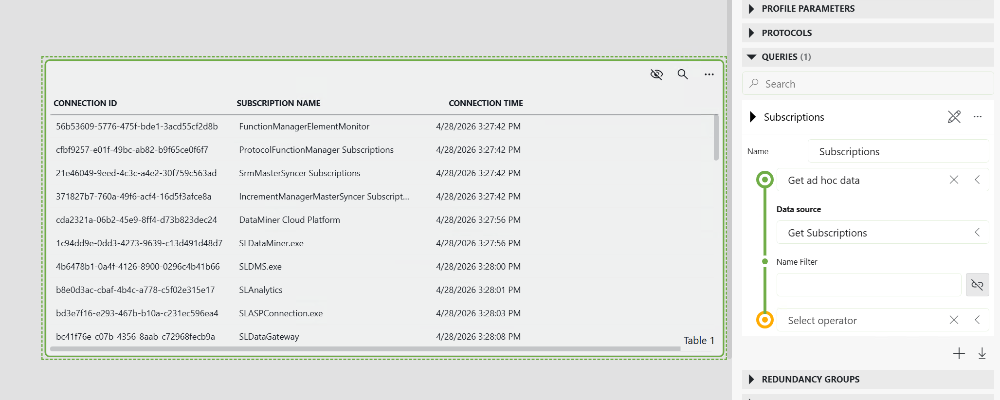
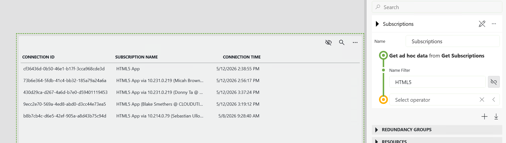

# Get Subscriptions

## About

**Get Subscriptions** is a GQI ad hoc data source that gives you a live table of every active client connection on your DataMiner System. Deploy it once and it immediately becomes available in any dashboard or low-code app query — no extra scripting or configuration required.

Use it to answer questions like: *Which clients are currently connected? How long have they been connected? Are there unexpected or stale subscriptions I should investigate?*

Each row in the result set represents one active connection, identified by a unique **Connection ID**, a human-readable **Subscription Name**, and the exact **Connection Time** at which the session was established. You can set up the GQI by inserting as an Adhoc Data Source in a Dashboard or Low-Code App:

## Key Features

- **Live connection overview**: Retrieves all active client connections from the DataMiner System in real time, so your dashboards and low-code apps always reflect the current state.
- **Name-based filtering**: Pass an optional *Name Filter* argument to limit results to connections whose subscription name contains a specific string — useful for isolating a particular client type or integration.
- **Plug-and-play GQI integration**: Works natively as a GQI data source; simply select *Get ad hoc data from Get Subscriptions* in any query and the data is ready to use.

## Use Cases

- **Operational dashboards**: Display all active DataMiner connections in a table component to give operators a real-time view of connected clients and their session start times.
- **Troubleshooting stale or unexpected connections**: Filter by name to quickly spot connections from a specific client type that have been open unusually long, helping diagnose integration or performance issues.
- **Connection auditing**: Capture a point-in-time snapshot of active subscriptions during an incident investigation or capacity planning exercise.

## Prerequisites

- DataMiner Main Release **10.2.0** or Feature Release **10.2.1** or higher (minimum version for GQI ad hoc data source support).

## Technical Reference

> For more information on GQI ad hoc data sources and how to use them in dashboards and low-code apps, refer to the [DataMiner documentation](https://aka.dataminer.services/gqi-external-data-source).
